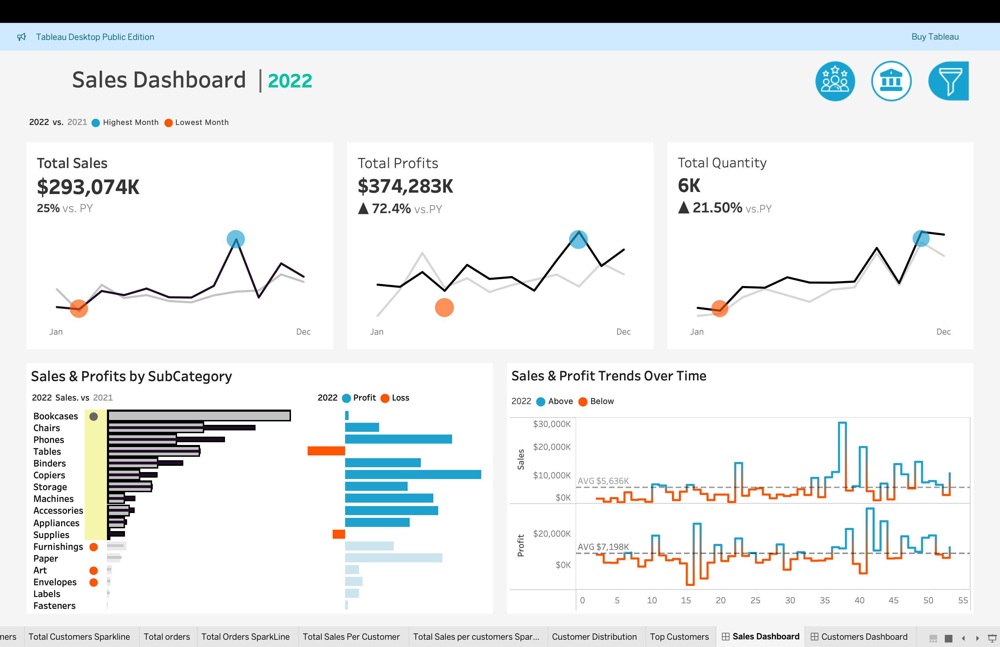
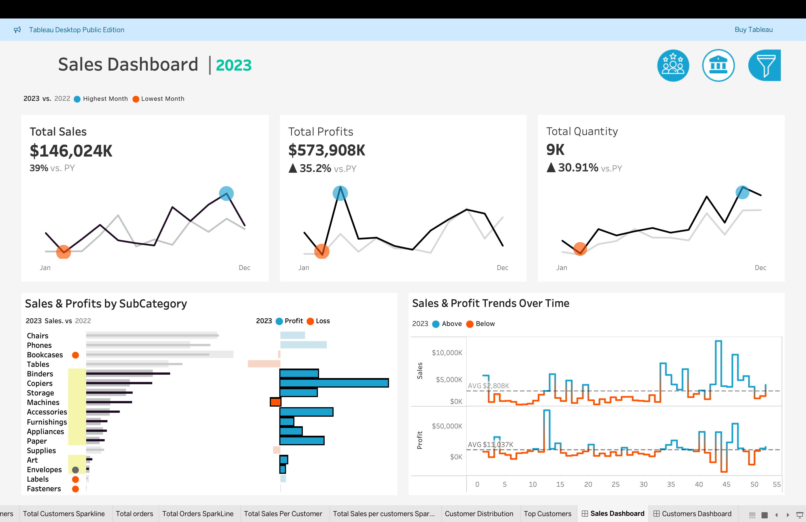
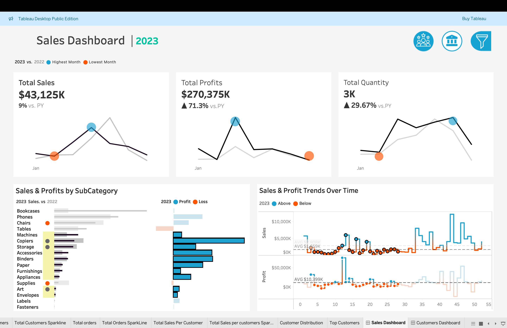

# 📊 Sales Analytics Dashboard - Tableau



An interactive and visually rich Tableau dashboard that provides key insights into sales, profits, customer segmentation, and regional performance. Built with usability and clarity in mind, this dashboard empowers businesses to make data-driven decisions.

🔗 **[View Live Dashboard on Tableau Public](https://public.tableau.com/app/profile/mahmoud.mohamed2232/viz/Sales-Analytics-Dashboard-Tableau/CustomersDashboard)**


---

## 🧰 Tools Used

- **Tableau** – Data visualization and dashboard development  
- **Microsoft Excel** – Data cleaning and transformation  
- **GitHub** – Version control and project sharing  

---

## 📌 Project Highlights

- 🎯 **KPI Overview:** Track sales, profit, discount, and quantity at a glance.
- 🌍 **Geo Visualization:** Identify high-performing regions with a dynamic map.
- 👥 **Customer Segmentation:** Understand customer behavior and profitability.
- 📈 **Trend Analysis:** Monitor monthly and yearly performance over time.
- 🧠 **Smart Filters:** Slice and dice your data by region, category, sub-category, and customer segment.

---

## 🖼️ Dashboard Previews

### 📌 Overview Page


### 🌍 Regional Analysis


### 👥 Customer Segmentation


---

## 📁 Project Structure

```plaintext
Sales-Analytics-Dashboard-Tableau/
├── Icons/                     # Custom icons used in Tableau visuals
├── dataset/                  # Raw and processed datasets
├── run images/               # Dashboard screenshots for README
├── .gitignore
├── README.md                 # This file
└── Sales-Analytics-Dashboard-Tableau.twbx  # Tableau workbook file
